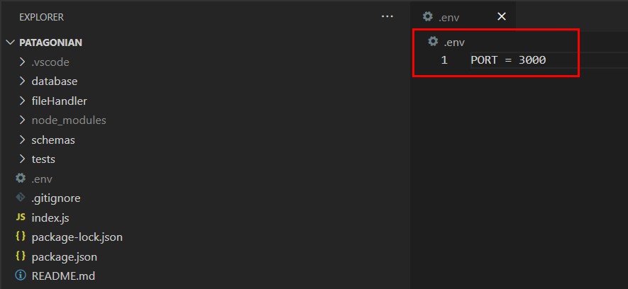

### Starting the server
- Start by defining the port in the .env file.
    

- Go to the root directory of the project and run `node .`
    

### Testing the API
Now our server is running, we can test our endpoint

#### Setting up the data file
Generate a .csv file with the following columns:

> Note: UUID, VIN Make and Model should be text, and Mileage, Year, Price, Zip Code, Create Date and Update Date should be integers.
#### Testing the endpoint

1. The method is POST.
2. In the request Url, the provider name is passed by parameter.
3. The body type is form-data.
4. Set the "key name" as file and type file and select the file to upload.
5. Press Send.

If it is a valid file, the endpoint will return a meesage and will store the generated .csv file in the /storage directory named as the provider.

If the file is missing columns, the request will return a validation error indicating the missing required fields:

> Note: If the original file has extra columns, the generated .csv will only containg the required ones.